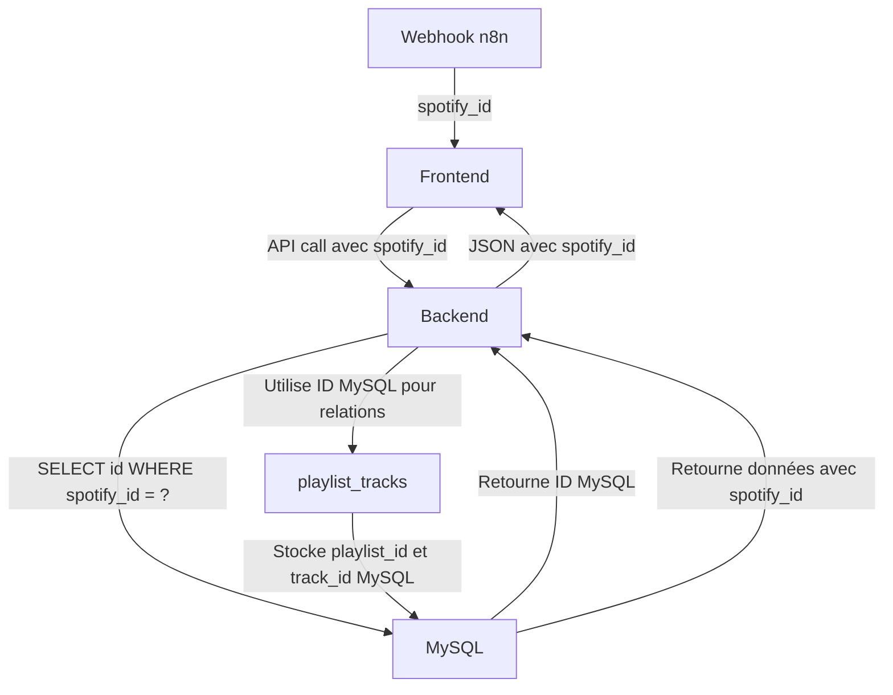

# 📋 Format des Données - Playlists et Tracks

## 🎯 Distinction importante : ID Spotify vs ID MySQL

### ID Spotify (spotify_id)
```
Format : String alphanumérique (ex: "37i9dQZF1DXcBWIGoYBM5M")
Utilisation : 
  - Dans les URLs Spotify
  - Dans les webhooks n8n
  - Dans les requêtes API frontend/backend
  - Clé unique pour identifier les entités Spotify
```

### ID MySQL (id)
```
Format : Integer auto-incrémenté (ex: 1, 2, 3...)
Utilisation :
  - Relations entre tables en BDD
  - Clé primaire dans chaque table
  - Foreign keys (playlist_id, track_id, etc.)
```

## 🔄 Flux de données pour les Playlists

### 1. Récupération des métadonnées de toutes les playlists

**Webhook n8n :**
```
https://tentacules.pantagruweb.club/webhook/getplaylist
```

**Retourne :**
```json
[
  {
    "id": "37i9dQZF1DXcBWIGoYBM5M",  // ← ID Spotify
    "name": "Today's Top Hits",
    "description": "Ed Sheeran is on top...",
    "snapshot_id": "MTczNjMyMjY2Myww...",
    "owner": {
      "display_name": "Spotify",
      "id": "spotify"
    },
    "images": [
      {
        "url": "https://i.scdn.co/image/ab67706f00000002..."
      }
    ],
    "external_urls": {
      "spotify": "https://open.spotify.com/playlist/37i9..."
    },
    "tracks": {
      "total": 50
    }
  },
  // ... autres playlists
]
```

### 2. Récupération des tracks d'une playlist spécifique

**Webhook n8n :**
```
https://tentacules.pantagruweb.club/webhook/playlist?id={spotify_id}
```

**Paramètre query :**
- `id` = **ID Spotify** de la playlist (ex: "37i9dQZF1DXcBWIGoYBM5M")

**Retourne :**
```json
[
  {
    "track": {
      "id": "7qiZfU4dY1lWllzX7mPBI",  // ← ID Spotify du track
      "name": "Shape of You",
      "duration_ms": 233713,
      "explicit": false,
      "popularity": 92,
      "preview_url": "https://p.scdn.co/mp3-preview/...",
      "external_urls": {
        "spotify": "https://open.spotify.com/track/7qiZf..."
      },
      "artists": [
        {
          "id": "6eUKZXaKkcviH0Ku9w2n3V",  // ← ID Spotify de l'artiste
          "name": "Ed Sheeran",
          "external_urls": {
            "spotify": "https://open.spotify.com/artist/6eUK..."
          }
        }
      ],
      "album": {
        "id": "3T4tUhGYeRNVUGevb0wThu",  // ← ID Spotify de l'album
        "name": "÷ (Deluxe)",
        "album_type": "album",
        "release_date": "2017-03-03",
        "images": [
          {
            "url": "https://i.scdn.co/image/ab67616d00001e02..."
          }
        ],
        "artists": [
          {
            "id": "6eUKZXaKkcviH0Ku9w2n3V",
            "name": "Ed Sheeran"
          }
        ]
      }
    },
    "added_at": "2025-01-08T12:00:00Z"
  },
  // ... autres tracks
]
```

## 🗄️ Sauvegarde en Base de Données

### Étape 1 : Conversion ID Spotify → ID MySQL

```javascript
// Backend : server.js ligne 333-366

// Reçoit le spotify_id depuis l'URL
const { spotify_id } = req.params  // Ex: "37i9dQZF1DXcBWIGoYBM5M"

// Cherche dans la BDD pour obtenir l'ID MySQL
const playlist = await query(
  'SELECT id FROM playlists WHERE spotify_id = ?', 
  [spotify_id]
)

// Si la playlist n'existe pas, la créer
if (playlist.length === 0) {
  // Créer la playlist avec le spotify_id
  const result = await query(
    'INSERT INTO playlists (spotify_id, name, ...) VALUES (?, ?, ...)',
    [spotify_id, 'Nom de la playlist', ...]
  )
  playlistId = result.insertId  // ← ID MySQL auto-incrémenté
} else {
  playlistId = playlist[0].id  // ← ID MySQL existant
}
```

### Étape 2 : Sauvegarde des relations

```sql
-- Table playlists : stocke le spotify_id et l'ID MySQL
CREATE TABLE playlists (
  id INT AUTO_INCREMENT PRIMARY KEY,    -- ID MySQL
  spotify_id VARCHAR(255) UNIQUE,       -- ID Spotify
  name VARCHAR(500),
  snapshot_id VARCHAR(255),
  ...
)

-- Table playlist_tracks : utilise les IDs MySQL
CREATE TABLE playlist_tracks (
  playlist_id INT,  -- ← ID MySQL de la playlist
  track_id INT,     -- ← ID MySQL du track
  position INT,
  added_at TIMESTAMP,
  FOREIGN KEY (playlist_id) REFERENCES playlists(id),
  FOREIGN KEY (track_id) REFERENCES tracks(id)
)
```

## 🔧 Utilisation dans l'application

### Frontend : Toujours utiliser l'ID Spotify

```javascript
// ✅ CORRECT : Utiliser l'ID Spotify
const playlistSpotifyId = "37i9dQZF1DXcBWIGoYBM5M"
await spotifyStore.fetchTracksByPlaylist(playlistSpotifyId)

// ❌ INCORRECT : N'utilisez JAMAIS l'ID MySQL depuis le frontend
const playlistMySQLId = 42
await spotifyStore.fetchTracksByPlaylist(playlistMySQLId)  // NE MARCHERA PAS
```

### Backend : Conversion automatique

```javascript
// Route API : reçoit l'ID Spotify
app.post('/api/playlists/:spotify_id/tracks', async (req, res) => {
  const { spotify_id } = req.params  // ID Spotify

  // Conversion automatique vers ID MySQL
  const playlist = await query(
    'SELECT id FROM playlists WHERE spotify_id = ?',
    [spotify_id]
  )

  const playlistId = playlist[0].id  // ID MySQL pour les relations
})
```

## 📝 Résumé du flux complet



## 🎯 Points clés

1. **Frontend/API** : Toujours utiliser `spotify_id` (string alphanumérique)
2. **Backend** : Convertit automatiquement `spotify_id` → `id` (MySQL)
3. **Relations BDD** : Toujours utiliser les IDs MySQL (`playlist_id`, `track_id`, etc.)
4. **Réponses API** : Retournent le `spotify_id` pour que le frontend puisse l'utiliser

## 🔍 Exemple concret

### Scénario : Sauvegarder les tracks de la playlist "Today's Top Hits"

**1. Frontend appelle :**
```javascript
// ID Spotify de la playlist
const playlistId = "37i9dQZF1DXcBWIGoYBM5M"

// Appel au webhook n8n
const tracks = await fetch(
  `https://tentacules.pantagruweb.club/webhook/playlist?id=${playlistId}`
)

// Sauvegarde en BDD (avec l'ID Spotify)
await savePlaylistTracksToDB(playlistId, tracks)
```

**2. Backend reçoit :**
```
POST /api/playlists/37i9dQZF1DXcBWIGoYBM5M/tracks
```

**3. Backend cherche en BDD :**
```sql
SELECT id FROM playlists WHERE spotify_id = '37i9dQZF1DXcBWIGoYBM5M'
-- Retourne: id = 5 (ID MySQL)
```

**4. Backend sauvegarde les relations :**
```sql
-- Utilise l'ID MySQL (5) pour les relations
INSERT INTO playlist_tracks (playlist_id, track_id, position)
VALUES (5, 142, 0),  -- playlist_id = 5 (MySQL)
       (5, 287, 1),
       (5, 91, 2)
```

**5. Backend met à jour la playlist :**
```sql
UPDATE playlists 
SET synced_at = NOW() 
WHERE id = 5  -- ID MySQL
```

## ✅ Correction appliquée

### Avant (Problème)
```javascript
// Si la playlist n'existait pas en BDD → Erreur 404
if (playlist.length === 0) {
  return res.status(404).json({ error: 'Playlist non trouvée' })
}
```

### Après (Solution)
```javascript
// Si la playlist n'existe pas, la créer automatiquement
if (playlist.length === 0) {
  console.log(`📝 Création de la playlist "${playlistInfo.name}" en BDD`)
  const createResult = await query(
    'INSERT INTO playlists (spotify_id, name, ...) VALUES (?, ?, ...)',
    [spotify_id, playlistInfo.name, ...]
  )
  playlistId = createResult.insertId
}
```

### Avantage

✅ Pas besoin de sauvegarder la playlist séparément avant ses tracks
✅ La playlist est créée automatiquement si elle n'existe pas
✅ Le `spotify_id` est correctement utilisé partout

## 🎉 Résultat

Maintenant, vous pouvez :
1. Récupérer les tracks d'une playlist par son **ID Spotify**
2. La playlist sera créée automatiquement si elle n'existe pas
3. Les relations sont correctement gérées avec les IDs MySQL
4. Tout est transparent pour le frontend qui utilise uniquement les IDs Spotify

---

**Note importante :** N'utilisez JAMAIS les IDs MySQL depuis le frontend. Utilisez toujours les `spotify_id` !

