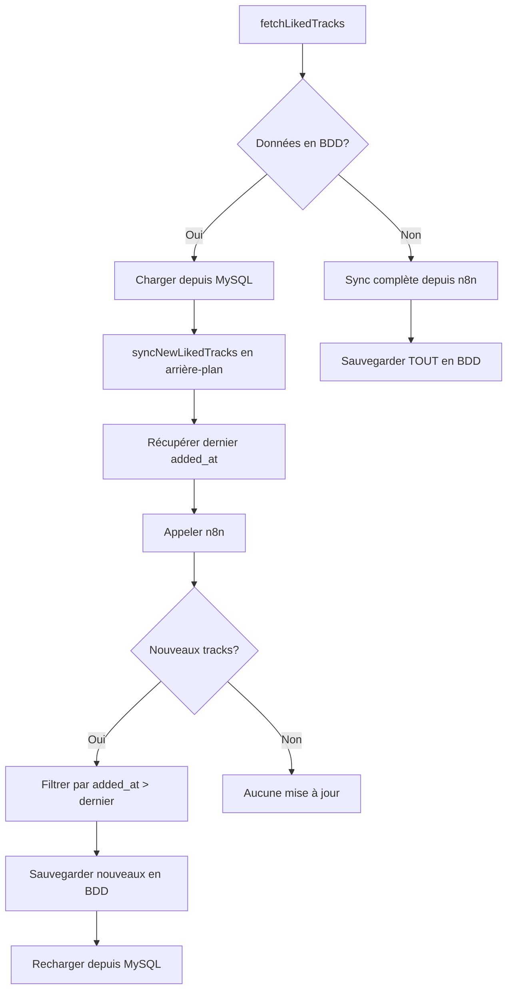
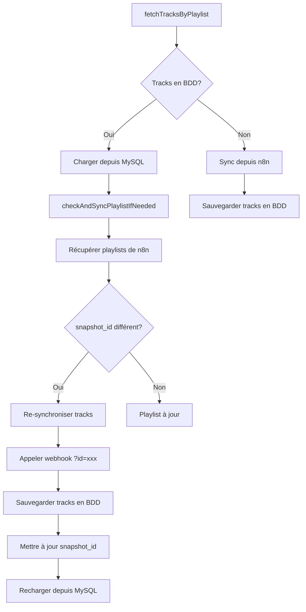

# 📊 Résumé de la Synchronisation Incrémentielle - Babines

## ✅ Ce qui a été implémenté

### 1. **Liked Tracks - Synchronisation incrémentielle par `added_at`**

#### Comment ça marche ?

```
1. Chargement initial → Depuis MySQL (instantané)
2. Vérification en arrière-plan → Compare avec n8n via added_at
3. Sauvegarde uniquement les nouveaux tracks
4. Mise à jour automatique de l'interface
```

#### Endpoints Backend

- **`GET /api/liked/:user_spotify_id`** - Récupère tous les liked tracks depuis MySQL
- **`GET /api/liked/:user_spotify_id/last-sync`** - Retourne le dernier `added_at` en BDD
- **`POST /api/liked/:user_spotify_id`** - Sauvegarde avec mode incrémentiel
  - Paramètre `incremental: true` → Compare et skip les anciens
  - Retourne : `{ saved, skipped, duplicates, total }`

#### Utilisation dans le Store

```javascript
// Chargement automatique avec sync incrémentiel en arrière-plan
await spotifyStore.fetchLikedTracks()
// → Charge depuis BDD + vérifie nouveaux tracks automatiquement

// Synchronisation complète forcée
await spotifyStore.syncLikedTracksFromAPI()
// → Recharge TOUT depuis n8n
```

---

### 2. **Playlists - Synchronisation intelligente par `snapshot_id`**

#### Comment ça marche ?

```
1. Récupération des tracks → Depuis MySQL
2. Vérification du snapshot_id → Compare BDD vs n8n
3. Si différent → Re-synchronise uniquement cette playlist
4. Mise à jour automatique du snapshot_id et de synced_at
```

#### Endpoints Backend

- **`GET /api/playlists/:spotify_id`** - Récupère la playlist avec ses tracks
- **`GET /api/playlists/:spotify_id/needs-sync`** - Vérifie si le snapshot_id a changé
  - Paramètre query : `?current_snapshot_id=xxx`
  - Retourne : `{ needs_sync, reason, db_snapshot_id, current_snapshot_id }`
- **`POST /api/playlists/:spotify_id/tracks`** - Sauvegarde les tracks avec relations
  - Gère **albums**, **artists**, **album_artists**, **track_artists**
  - Mise à jour automatique de `synced_at`

#### Utilisation dans le Store

```javascript
// Chargement avec vérification automatique du snapshot_id
await spotifyStore.fetchTracksByPlaylist(playlistId)
// → Charge depuis BDD + vérifie si modifiée via snapshot_id

// Synchronisation manuelle forcée
await spotifyStore.syncTracksFromAPI(playlistId)
// → Force la re-synchronisation depuis n8n
```

---

### 3. **Logs de synchronisation dans `sync_logs`**

Chaque synchronisation est enregistrée :

#### Endpoints

- **`POST /api/sync-logs`** - Crée un nouveau log
- **`PUT /api/sync-logs/:id`** - Met à jour un log existant
- **`GET /api/sync-logs?type=xxx&limit=50`** - Récupère l'historique

#### Types de logs

- `liked_tracks` - Sync incrémentiel liked tracks
- `liked_tracks_full` - Sync complète liked tracks
- `playlist_tracks` - Sync d'une playlist modifiée
- `playlists` - Sync de toutes les playlists

#### Structure du log

```json
{
  "id": 123,
  "sync_type": "liked_tracks",
  "status": "success|error|in_progress",
  "started_at": "2025-10-10T14:30:00Z",
  "completed_at": "2025-10-10T14:30:15Z",
  "items_processed": 5,
  "error_message": null,
  "details": {
    "new_tracks": 5,
    "saved": 5,
    "skipped": 0
  }
}
```

---

## 🗄️ Structure de la Base de Données

### Tables principales

```
users                  - Utilisateurs Spotify
  ├─ liked_tracks     - Tracks likés (user_id + track_id)
  └─ playlists        - Playlists de l'utilisateur

tracks                 - Morceaux
  ├─ album_id         → albums
  └─ track_artists    - Relation M-N avec artists

albums                 - Albums
  └─ album_artists    - Relation M-N avec artists

artists                - Artistes

playlists              - Playlists
  ├─ snapshot_id      - Pour détecter les changements
  ├─ synced_at        - Dernière synchronisation
  └─ playlist_tracks  - Relation M-N avec tracks

sync_logs              - Historique des synchronisations
```

### Relations importantes

#### `playlist_tracks` (Playlists ↔ Tracks)

```sql
CREATE TABLE playlist_tracks (
  playlist_id INT,
  track_id INT,
  position INT,           -- Position dans la playlist
  added_at TIMESTAMP,     -- Quand ajouté à la playlist
  FOREIGN KEY (playlist_id) REFERENCES playlists(id),
  FOREIGN KEY (track_id) REFERENCES tracks(id)
)
```

#### `album_artists` (Albums ↔ Artistes)

```sql
CREATE TABLE album_artists (
  album_id INT,
  artist_id INT,
  position INT,           -- Ordre des artistes
  FOREIGN KEY (album_id) REFERENCES albums(id),
  FOREIGN KEY (artist_id) REFERENCES artists(id)
)
```

#### `track_artists` (Tracks ↔ Artistes)

```sql
CREATE TABLE track_artists (
  track_id INT,
  artist_id INT,
  position INT,           -- Ordre des artistes
  FOREIGN KEY (track_id) REFERENCES tracks(id),
  FOREIGN KEY (artist_id) REFERENCES artists(id)
)
```

---

## 🔄 Flux de synchronisation

### Liked Tracks



### Playlists



---

## 📝 API Service Frontend

### Fonctions disponibles

```javascript
// Playlists
savePlaylistToDB(playlist)
savePlaylistTracksToDB(playlistId, tracks)
getPlaylistsFromDB()
getPlaylistFromDB(spotifyId)
checkPlaylistNeedsSync(playlistSpotifyId, currentSnapshotId)

// Liked Tracks
saveLikedTracksToDB(userSpotifyId, tracks, incremental = false)
getLikedTracksFromDB(userSpotifyId)
getLastLikedTrackSync(userSpotifyId)

// Logs
createSyncLog(syncType, status, itemsProcessed, errorMessage, details)
updateSyncLog(logId, status, itemsProcessed, errorMessage, details)
getSyncLogs(syncType, limit)
```

---

## 🎯 Points clés de l'implémentation

### 1. Pas besoin de user_id
✅ Les credentials Spotify sont gérés par n8n
✅ On utilise `default_user` comme ID par défaut

### 2. Arrêt automatique au dernier résultat
✅ **Liked Tracks** : Compare `added_at` et skip si ≤ dernier en BDD
✅ **Playlists** : Compare `snapshot_id` et skip si identique

### 3. Relations by ID Spotify
✅ Un track peut être dans plusieurs playlists
✅ Un album peut avoir plusieurs artistes
✅ Un track peut avoir plusieurs artistes
✅ Toutes les relations utilisent des IDs Spotify uniques

### 4. Appel webhook avec query param
✅ Playlists : `https://...webhook/playlist?id={spotify_id}`
✅ Retourne tous les tracks de la playlist avec leurs métadonnées complètes

### 5. Sauvegarde complète des relations
✅ `albums` → `album_artists` → `artists`
✅ `tracks` → `track_artists` → `artists`
✅ `playlists` → `playlist_tracks` → `tracks`

---

## 🚀 Prochaines étapes possibles

### 1. Synchronisation automatique périodique
```javascript
// Vérifier les nouveaux liked tracks toutes les 5 minutes
setInterval(() => {
  spotifyStore.syncNewLikedTracks()
}, 5 * 60 * 1000)
```

### 2. Interface de visualisation des logs
```vue
<template>
  <div class="sync-logs">
    <h2>Historique des synchronisations</h2>
    <div v-for="log in syncLogs" :key="log.id">
      <div :class="log.status">
        {{ log.sync_type }} - {{ log.status }}
        {{ log.items_processed }} items
      </div>
    </div>
  </div>
</template>

<script setup>
import { ref, onMounted } from 'vue'
import { getSyncLogs } from '@/services/api'

const syncLogs = ref([])

onMounted(async () => {
  syncLogs.value = await getSyncLogs(null, 20)
})
</script>
```

### 3. Notifications de nouveaux tracks
```javascript
// Après syncNewLikedTracks
if (result.saved > 0) {
  notificationStore.show({
    type: 'success',
    message: `${result.saved} nouveaux tracks ajoutés !`
  })
}
```

### 4. Export de données
- Export des playlists en JSON/CSV
- Backup automatique de la BDD
- Statistiques d'écoute

---

## 📊 Statistiques d'utilisation

Pour voir les stats de synchronisation :

```javascript
import { getSyncLogs } from '@/services/api'

// Dernières 100 synchronisations
const logs = await getSyncLogs(null, 100)

// Calculer les stats
const stats = {
  total: logs.length,
  success: logs.filter(l => l.status === 'success').length,
  errors: logs.filter(l => l.status === 'error').length,
  totalItems: logs.reduce((sum, l) => sum + l.items_processed, 0)
}

console.log(stats)
// → { total: 100, success: 98, errors: 2, totalItems: 15432 }
```

---

## 🎉 Avantages du système

| Avantage | Description |
|----------|-------------|
| ⚡ **Performance** | Charge depuis BDD (instantané) + sync en arrière-plan |
| 💾 **Économie** | Ne télécharge que les nouveaux éléments |
| 🔄 **Automatique** | Détection intelligente des changements |
| 📝 **Traçable** | Tous les logs dans `sync_logs` |
| 🎯 **Précis** | Arrêt au dernier résultat identique |
| 🔗 **Relationnel** | Gère toutes les relations albums/artistes |
| 🛡️ **Robuste** | Gestion d'erreurs + retry possible |

---

## 📚 Documentation associée

- `SYNCHRONISATION_INCREMENTIELLE.md` - Documentation détaillée
- `database/schema.sql` - Schéma complet de la BDD
- `SAUVEGARDE_AUTO_BDD.md` - Guide de sauvegarde

---

## 🐛 Débogage

### Voir les logs de synchronisation

```javascript
// Dans la console du navigateur
import { getSyncLogs } from '@/services/api'

// Voir les derniers logs
const logs = await getSyncLogs('liked_tracks', 10)
console.table(logs)
```

### Forcer une synchronisation complète

```javascript
// Si les données semblent incohérentes
await spotifyStore.syncLikedTracksFromAPI()
// Recharge TOUT depuis n8n
```

### Vérifier le dernier sync

```javascript
import { getLastLikedTrackSync } from '@/services/api'

const lastSync = await getLastLikedTrackSync('default_user')
console.log('Dernier track ajouté:', lastSync.last_added_at)
```

---

✅ **Système de synchronisation incrémentielle complètement opérationnel !**

